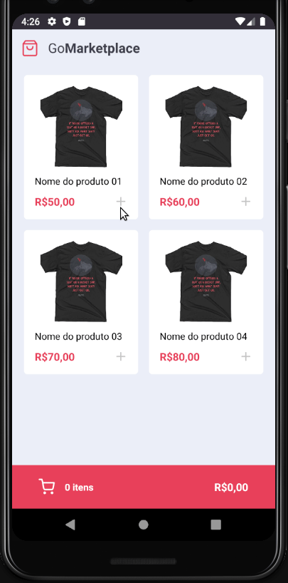
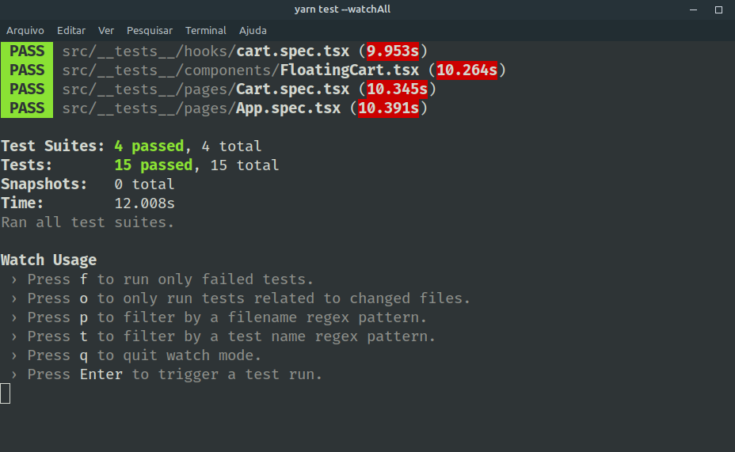

# Desafio 08

> Projeto Aplicado pela rocketseat durante o bootcamp :rocket: Gostack 11 .

### Sobre o Desafio

Nesse desafio, foi desenvolvida uma nova aplicação, a **GoMarketplace**. O objetivo é praticar o que foi aprendido com **React Native**, junto com **TypeScript**, utilizando rotas, Async Storage e a Context API.

### Utilização

- **localhost/products**: utilizamos uma Api fake para deixamos pré instalada uma dependência chamada `json-server`, que contém os dados de uma rota `/products`. Para executar o servidor utilize o seguinte comando

```bash
yarn json-server server.json -p 3333
```



## Configuração para Desenvolvimento

- Basta utilizar o gerenciador de pacotes para instalar todas as dependências do projeto que já estão no arquivo `package.json`.

```sh
yarn || npm
```

### Dependências do projeto

> :thumbsup: Dependencias de Desenvolvimento.

```json
"devDependencies": {
    "@babel/core": "^7.6.2",
    "@babel/runtime": "^7.6.2",
    "@react-native-community/eslint-config": "^1.0.0",
    "@testing-library/jest-native": "^3.1.0",
    "@testing-library/react-native": "^5.0.3",
    "@types/jest": "^24.0.24",
    "@types/react-native": "^0.62.0",
    "@types/react-native-vector-icons": "^6.4.5",
    "@types/react-test-renderer": "16.9.2",
    "@types/styled-components": "^5.1.0",
    "@typescript-eslint/eslint-plugin": "^2.27.0",
    "@typescript-eslint/parser": "^2.27.0",
    "axios-mock-adapter": "^1.18.1",
    "babel-jest": "^24.9.0",
    "eslint": "^6.8.0",
    "eslint-config-airbnb": "^18.1.0",
    "eslint-config-airbnb-typescript": "^7.2.1",
    "eslint-config-prettier": "^6.10.1",
    "eslint-import-resolver-typescript": "^2.0.0",
    "eslint-plugin-import": "^2.20.1",
    "eslint-plugin-jsx-a11y": "^6.2.3",
    "eslint-plugin-prettier": "^3.1.3",
    "eslint-plugin-react": "^7.19.0",
    "eslint-plugin-react-hooks": "^3.0.0",
    "jest": "^24.9.0",
    "metro-react-native-babel-preset": "^0.58.0",
    "prettier": "^2.0.4",
    "react-test-renderer": "16.11.0",
    "ts-jest": "^25.4.0",
    "typescript": "^3.8.3"
  }
```

> :thumbsup: Dependencias de produção.

```json
"dependencies": {
   "@react-native-community/async-storage": "^1.9.0",
   "@react-native-community/masked-view": "^0.1.10",
   "@react-navigation/native": "^5.1.5",
   "@react-navigation/stack": "^5.2.10",
   "axios": "^0.19.2",
   "intl": "^1.2.5",
   "json-server": "^0.16.1",
   "react": "16.11.0",
   "react-native": "0.62.2",
   "react-native-gesture-handler": "^1.6.1",
   "react-native-iphone-x-helper": "^1.2.1",
   "react-native-reanimated": "^1.8.0",
   "react-native-safe-area-context": "^0.7.3",
   "react-native-screens": "^2.4.0",
   "react-native-vector-icons": "^6.6.0",
   "styled-components": "^5.1.0"
 },
```

### Testes

Para execução de testes utilize o comando abaixo.

```sh

npm test ou yarn test
```



### :v: :v: Contato

:v: Talita Azevedo :v: – [Github - tnazevedo](https://github.com/tnazevedo/) – talita.azevedo360@gmail.com

### :star: :star: :star: Como Contribuir

1. Faça o _fork_ do projeto [`Clique aqui`:v:](https://github.com/tnazevedo/Desafio08-FundamentosDoReactNative)
2. Crie uma _branch_ para sua modificação (`git checkout -b feature/fooBar`)
3. Faça o _commit_ (`git commit -am 'Add some fooBar'`)
4. _Push_ (`git push origin feature/fooBar`)
5. Crie um novo _Pull Request_.
